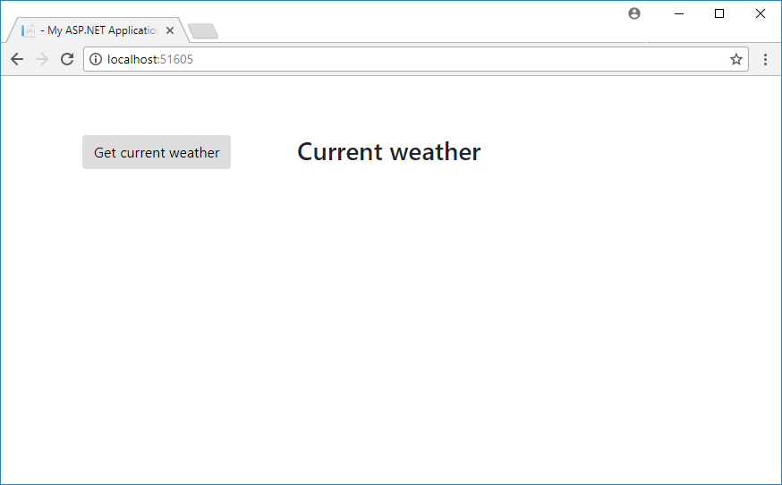
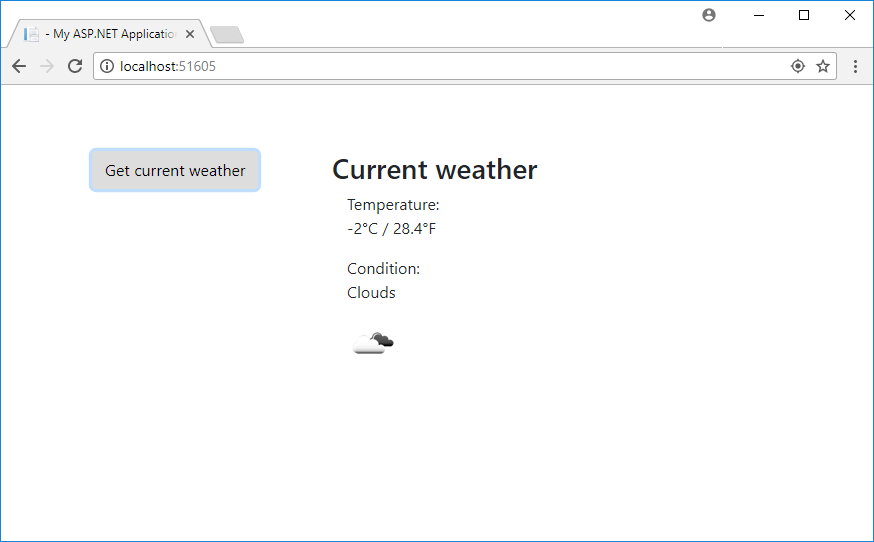
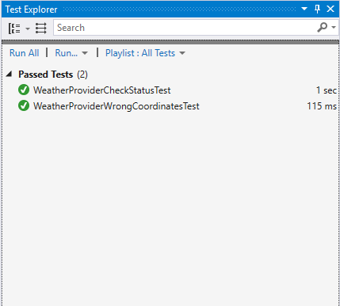

# CurrentWeatherDemo
Just a demo demonstrating how to implement sample weather condition check

How to get:
Run the following command:
git clone https://github.com/sergeiborisov/CurrentWeatherDemo.git

How to run:
Open CurrentWeatherDemo.sln in VisualStudio2017 (with Microsoft .NET Framework 4.7.1 SDK), build the solution (F6) and run it (F5).

Spent time: 2 hours (+ some time to update my environment, create the GitHub account and place the solution there)

Comments: UI is very simple but can be easily extended. The solution contains the test project with a couple of unit-tests. Tested for 2 browsers: Chrome and IE11.

